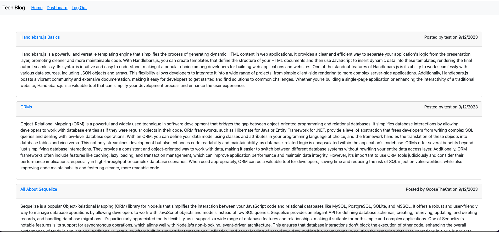
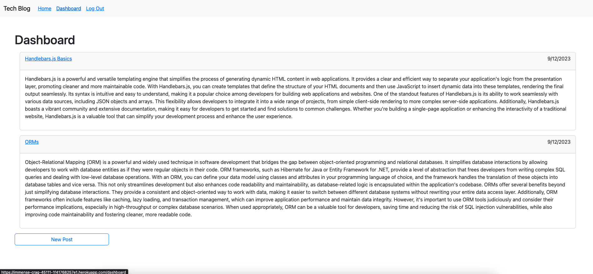
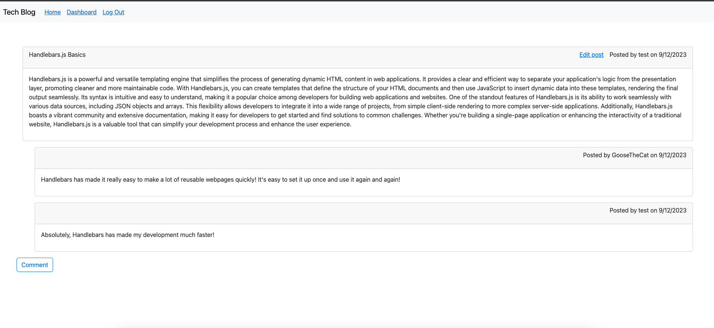
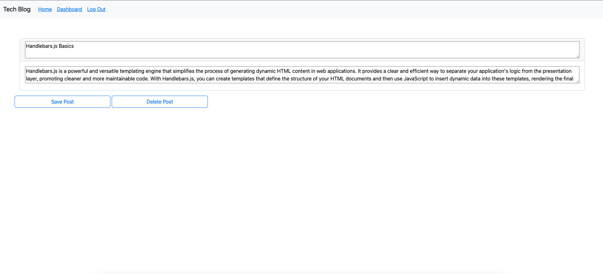
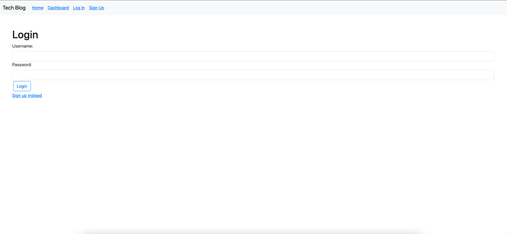
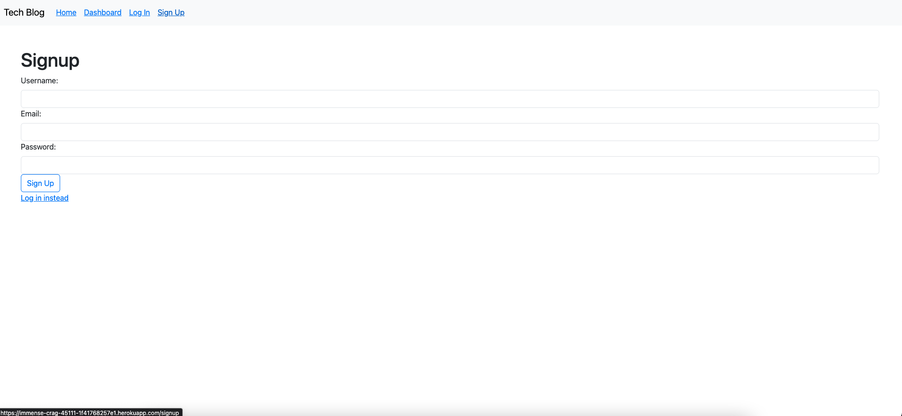

# Tech Blog

## Description

This full stack application is a simple blog website where users can create and comment on posts. It keeps track of users, dynamically displays content based on whether you're logged in, and stores posts and their associated comments. This project used a web hosted database, Handlebars.js as the templating engine, sessions, and password hashing.

## Installation
The deployed heroku app is available here: https://immense-crag-45111-1f41768257e1.herokuapp.com/

## Usage

To browse existing posts, simply visit the homepage of the site. A list of all existing blogs will automatically populate there.
To write a new post, the user must login or sign up. 
Once the user is logged in, they can go to their dashboard. From there, they have an option to make a new post. 
When logged in, the user can also add comments to existing posts. Simply click to the post page, and then click the "Comment" button. 
From the dashboard view, the user can also click on "Edit Post". This page will allow them to either update the content of the post, or delete it entirely.

## Credits
Please note that the content of the blog posts was generated by chat GPT as it is just placeholder information intended to indicate how the blog would be used in the real world. All the code is my own.

## License
Please refer to the license in this repository.